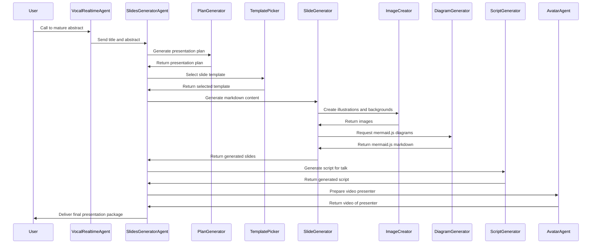
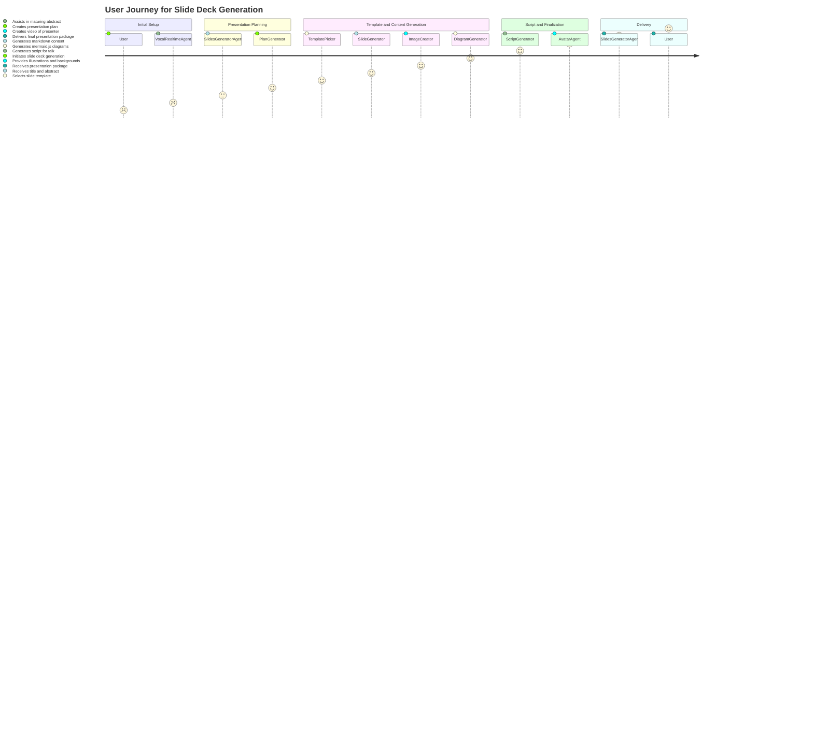

# System Prompt 

``` 
You are a Product Manager responsible for facilitating the onboarding of new developers on an existing code base repository. Your task is to create *mermaid*-compatible diagrams based on provided descriptions and instructions related to the flux between Services, AI Models, AI Agents and other potential dependencies. You will generate sequence diagrams or other types of diagrams as specified.
```


# User Prompt

```
We have developed an application that will help the user generate a slide deck in case of an urgent conference presentation. 
The application works with various agents that will work together to generate the different steps required for a slide deck generation.
Here are the existing agents and how they can call each other : 
- The speaker will initially call a vocal realtime agent that helps mature the abstract of the presentation
- The title and abstracts are shared with a slides generator agent that orchestrates the generation of the actual presentation by calling specialized agents.
- The first aget to be called is the plan generator that will generate the presentation plan 
- Then, a Template picker selects the most appropriate slide template to maximize the compatibility with the future generated content
- A slide generator then generates the markdown content of the slide based on the template that was selected
- Finally, when all the slides are generated, a Script generator would kick in and generate the script for the talk
- To generate the slides, the slide generator has access to an image creator that creates illustrations and backgrounds for the slides thanks to using Dall-E3
- The slide generator can also rely on a diagram generator that relies on GPT to generate a markdown code compatible with the mermaid.js framework 
Finally, once EVERYTHING is ready, an avatar agent is being created to create a video of a presenter that will make the talk.
 ```


# Result 



# Translate as a User Journey Diagram

``` 
Could you make it suitable as a user journey diagram ?
```

